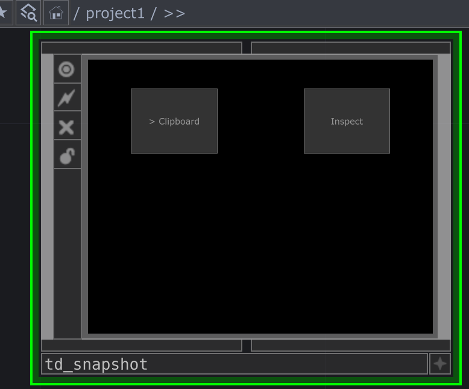
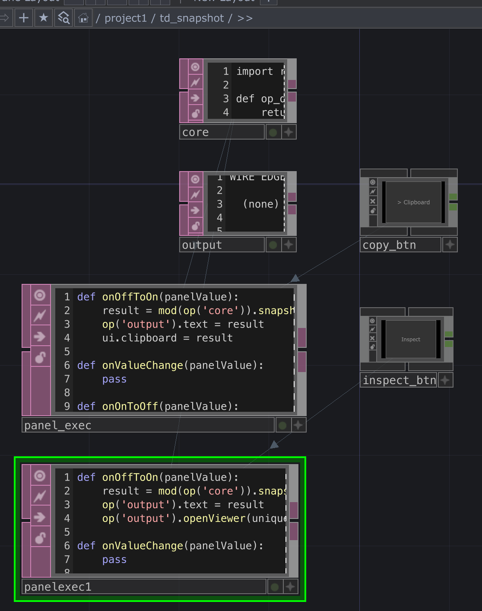

# td-snapshot

TouchDesigner networks are invisible to LLMs. This script captures your network as structured text — wiring, operator types, and every parameter that differs from its default — so you can paste it into a chat and get meaningful help debugging, refactoring, or explaining what a patch does.

It also works without LLMs: snapshot before and after a change and diff the output, or just audit what's actually non-default in a patch you inherited.

## Scope

`snapshot_patch()` captures the root operator and **all of its descendants** recursively. To target a specific sub-network, pass its path directly to `snapshot_patch()`.

The component running the snapshot excludes itself and its own children from the output automatically.

OP-typed value refs are recorded unconditionally — including targets in `/sys/`, `/local/`, and other system paths.

## Repo structure

```
src/
  core.py                ← edit this — snapshot_patch() lives here
  quickpaste_runner.py   ← entry point for Option 1 (Quick paste); concatenated onto core.py to produce td-snapshot.py
  tox_runner_copy.py     ← Option 2 — script that runs in the TOX's Copy button (Panel Execute DAT)
  tox_runner_inspect.py  ← Option 2 — script that runs in the TOX's Inspect button (Panel Execute DAT)
  hashes.txt             ← GENERATED — source file checksums, also a Text DAT in the TOX
td-snapshot.py           ← BUILT — do not edit directly
td-snapshot.tox          ← BUILT — the distributable component, drop into any project
build.sh                 ← rebuilds td-snapshot.py from src/ (calls stamp.sh first)
stamp.sh                 ← stamps version headers into src/*.py, generates src/hashes.txt
versions.txt             ← per-file version numbers — bump individually on changes
toeexpand/               ← text expansion of the dated .tox via toeexpand, for git diffing
```

After editing `src/core.py`, run `./build.sh` to regenerate `td-snapshot.py` (it calls `./stamp.sh` automatically). To bump a file's version, edit the corresponding entry in `versions.txt` then run `./build.sh`. Then export a fresh `td-snapshot.tox` from TouchDesigner (right-click the Container COMP > **Save Component**).

The `toeexpand/` directory is a text expansion of the `.tox` generated by TD's **toeexpand** utility. It has no runtime use — it exists so git can diff the binary `.tox` as readable text.

## What it captures

**WIRE EDGES** — every operator wire connection, annotated with input/output slot indices.

```
  /project1/blur1 [Blur TOP] -[in:0]-> /project1/out1 [Out TOP]
  /project1/noise1 [Noise TOP] -[out:1, in:0]-> /project1/comp1 [Composite TOP]
```

**REFERENCE EDGES** — parameter-driven dependencies: `op()` calls inside expressions, and OP-typed parameters set by value (e.g. a Feedback TOP's `top` parameter).

```
  /project1/feedback1 [Feedback TOP] -[top]-> /project1/render1 [Render TOP]
  /project1/math1 [Math CHOP] -[choppath]-> /project1/audioin1 [Audio In CHOP]
```

**NODES** — a per-operator block showing input slots, outputs, changed parameters, and local references.

```
/project1/blur1 [Blur TOP]
  input_slots:
    [0] /project1/noise1
  outputs: /project1/out1 [Out TOP]
  par blury: current=5.0, default=1.0, mode=CONSTANT
  par filter: current='gaussian', default='box', mode=CONSTANT
```

Only parameters that differ from their defaults are shown — or any parameter driven by an expression, export, or bind, regardless of value. Stock settings are omitted to keep the output readable.


## Usage Option 1: Quick paste

The fastest way to use it. No TOX required.

1. Copy `td-snapshot.py` into a **Text DAT** in your project.
2. Right-click the DAT > **Run Script**.

A new Text DAT named `td_snapshot_<timestamp>` is created in the same network and opens as a floating viewer. Select all and copy from there.

To target a specific network instead of the Text DAT's parent, edit the first line of `td-snapshot.py` before running:

```python
result = snapshot_patch('/project1/mycomp')
```


## Usage Option 2: TOX component (reusable, button-triggered)

A Container COMP saved as a `.tox` that you can drop into any project. Two buttons — **Copy** and **Inspect** — each run the snapshot fresh and either put the result on your clipboard or open it in a floating viewer for reading. You can use the `.tox` direclty form this repo.

### TOX Development
If you want to make changes, here is how the project is built.



Build the component with these operators inside a Container COMP:

| Type | Name | Source file |
|---|---|---|
| Text DAT | `core` | `src/core.py` |
| Text DAT | `output` | *(leave empty)* |
| Text DAT | `hashes` | `src/hashes.txt` |
| Button COMP | `copy_btn` | *(no file — set Label to "Copy")* |
| Button COMP | `inspect_btn` | *(no file — set Label to "Inspect")* |
| Panel Execute DAT | `tox_runner_copy` | `src/tox_runner_copy.py` |
| Panel Execute DAT | `tox_runner_inspect` | `src/tox_runner_inspect.py` |

Set both Button COMPs to **Momentary** mode.

### Loading the scripts

For each DAT that has a source file, go to its **File** tab, set **File** to the absolute path of the corresponding `src/` file, and enable **Sync to File**. The DAT will pull in the file contents automatically. This keeps DATs in sync with the source without copy-pasting.

The `hashes` DAT is read-only reference — sync it the same way, but you don't need to update it manually; `./build.sh` regenerates `src/hashes.txt` on every run.



### Wiring the buttons

Each Panel Execute DAT needs its **Panels** parameter pointed at its corresponding button using the **relative name** (e.g. `copy_btn`, not a full path — absolute paths break when the component is dropped into a different network), **Panel Value** set to `select`, and **Off to On** set to **On**.

- **Copy** (`src/tox_runner_copy.py`) — runs the snapshot, writes to `output`, copies text to clipboard
- **Inspect** (`src/tox_runner_inspect.py`) — runs the snapshot, writes to `output`, opens a floating DAT viewer you can select and copy from

### Saving and reusing

Before saving for distribution, strip the file paths from every DAT that has one (`core`, `hashes`, `tox_runner_copy`, `tox_runner_inspect`):

1. Go to the **File** tab on each DAT
2. Clear the **File** field
3. Turn **Sync to File** off

The text content is already embedded — clearing the path just removes the external reference and any personal file system information. Nothing is lost.

Then right-click the Container COMP > **Save Component** and save as `td-snapshot.tox`.

If you want to keep the live file sync for your own development copy, re-set the File paths after saving — the `.tox` is a separate snapshot and won't be affected.

Drop the `.tox` into any future project from the palette or filesystem.


